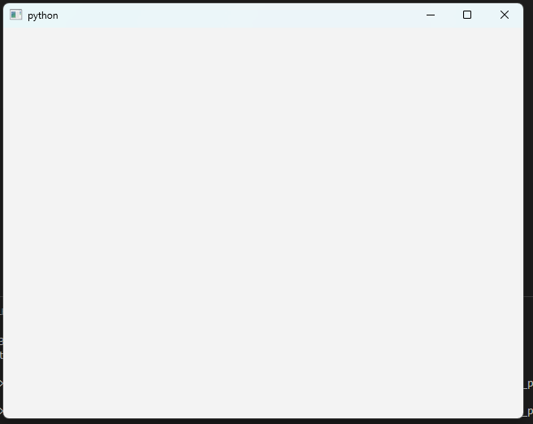

# Getting started

## Creating an application

```python
from PyQt6.QtWidgets import QApplication, QWidget
import sys

app = QApplication(sys.argv)
window = QWidget()
window.show()
app.exec()
```



- You need one (and only one) QApplication instance per application.
- Pass in sys.argv to allow command line arguments for your app. if not needed, QApplication([]) works too.
- Qt widget (windows) will be our window.
- Windows are hidden by default. To show call method show().
- app.exec() starts the event loop.
- Untill exit, the event loop won't stop.
