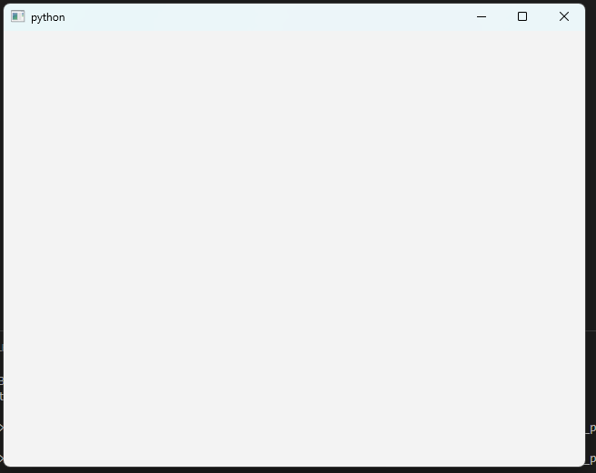
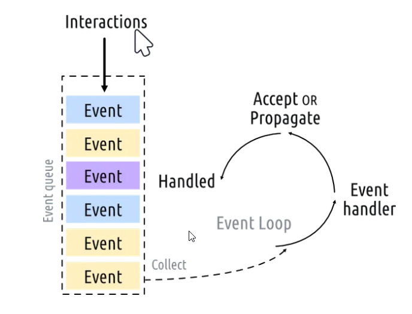
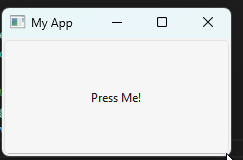

# Getting started

## Creating an application

```python
from PyQt6.QtWidgets import QApplication, QWidget
import sys

app = QApplication(sys.argv)
window = QWidget()
window.show()
app.exec()
```



- You need one (and only one) QApplication instance per application.
- Pass in sys.argv to allow command line arguments for your app. if not needed, QApplication([]) works too.
- Qt widget (windows) will be our window.
- Windows are hidden by default. To show call method show().
- Widgets without a parent are invisible by default. So, after creating the window object, we must always call .show() to make it visible.
- app.exec() starts the event loop.
- Untill exit, the event loop won't stop.
- In Qt all top level widgets are windows -- that is, they don't have a parent and are not nested within another widget or layout.

## What is a window?

- Holds the user-interface of your application - Every application needs at least one (...but can have more)
- Application will (by default) exit when last window is closed

## What's the event loop?

- The core of every Qt Applications is the QApplication class.
- Every application needs one — and only one — QApplication object to function.
- This object holds the event loop of your application — the core loop which governs all user interaction with the GUI.
- Each interaction with your application — whether a press of a key, click of a mouse, or mouse movement — generates an event which is placed on the event queue.
- In the event loop, the queue is checked on each iteration and if a waiting event is found, the event and control is passed to the specific event handler for the event.
- The event handler deals with the event, then passes control back to the event loop to wait for more events.
- There is only one running event loop per application.



## QMainWindow

- This is a pre-made widget which provides a lot of standard window features.
- including toolbars, menus, a statusbar, dockable widgets and more.
- If you want to create a **custom window**, the best approach **is to subclass QMainWindow** and then include the setup for the window in the \__init__ block.

```python
import sys
from PyQt6.QtCore import QSize, Qt
from PyQt6.QtWidgets import QApplication, QMainWindow, QPushButton

# Subclass QMainWindow to customize your application's main window
class MainWindow(QMainWindow):
    def __init__(self):
        super().__init__()

        self.setWindowTitle("My App")
        button = QPushButton("Press Me!")

        # Set the central widget of the Window.
        self.setCentralWidget(button)
app = QApplication(sys.argv)
window = MainWindow()
window.show()
app.exec()
```



## Sizing windows and widgets

- In Qt sizes are defined using a **QSize** object.
- Other options
  - .setFixedSize()
  - .setMinimumSize()
  - .setMaximumSize()

```python
import sys
from PyQt6.QtCore import QSize, Qt
from PyQt6.QtWidgets import QApplication, QMainWindow, QPushButton
class MainWindow(QMainWindow):
    def __init__(self):
        super().__init__()
        self.setWindowTitle("My App")
        button = QPushButton("Press Me!")
        self.setFixedSize(QSize(400, 300))
        self.setCentralWidget(button)
app = QApplication(sys.argv)
window = MainWindow()
window.show()
app.exec()
```

